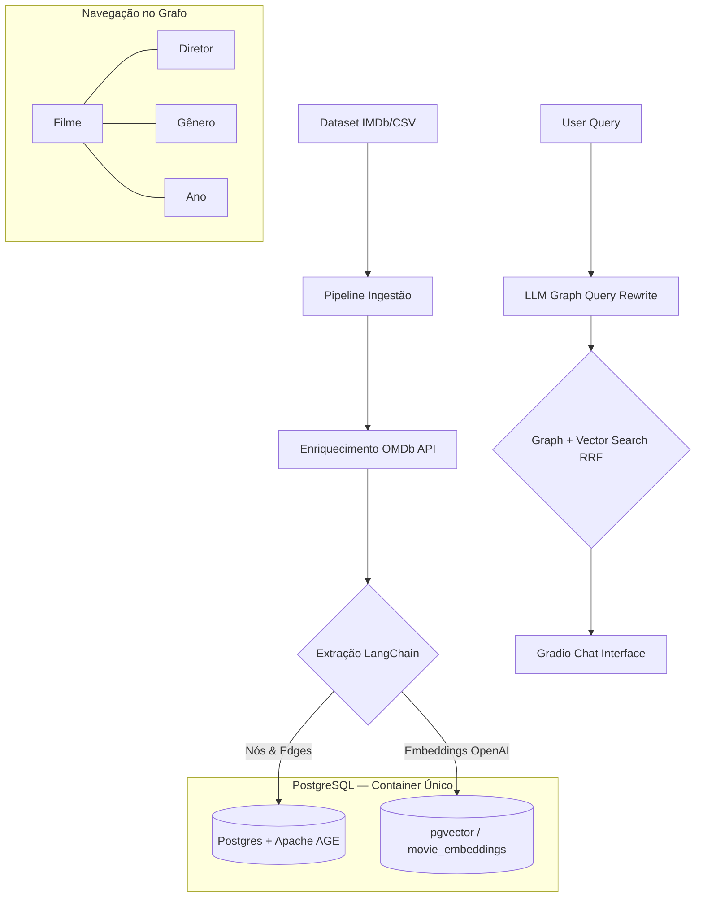

# 🎬 CineGraph-AI: GraphRAG para Descoberta de Filmes


> **Elevando a recomendação de filmes através de Grafos de Conhecimento e Inteligência Semântica.**

---

## 📌 O Problema

Sistemas de recomendação tradicionais são baseados em filtros simples (Ano, Gênero) ou em buscas por palavras-chave. Eles falham em responder perguntas contextuais complexas que exigem correlação de dados e análise de enredo, como:

> *"Quais filmes de ficção científica com nota maior que 8.0 foram dirigidos pelo mesmo diretor de 'Inception' e têm tramas envolvendo manipulação do tempo?"*

## 💡 A Solução: GraphRAG

O **CineGraph-AI** utiliza a arquitetura **GraphRAG** para conectar metadados estruturados a descrições semânticas. O sistema não apenas "busca" filmes, ele "navega" pela rede de diretores, gêneros e linhas do tempo antes de aplicar a busca vetorial no enredo.

### Benefícios
- **Descoberta Relacional**: Encontre conexões entre diretores e temas que filtros comuns ignoram.
- **Filtros Híbridos**: Combine meta-dados (IMDb Rating, Year) com busca semântica (Description) em uma única consulta.
- **Explicação de Resposta**: O sistema consegue explicar *por que* recomendou um filme com base nos nós do grafo.

---

## 🏗️ Arquitetura da POC



---

## 🧬 Modelo de Dados (Ontologia)

Baseado nas colunas reais do dataset (`data/raw/movies.csv` — exportação pessoal do IMDb, 792 filmes, 18 colunas):

| Coluna | Tipo | Uso |
| :--- | :--- | :--- |
| `Title` / `Original Title` | `str` | Identificador principal do nó `Movie` |
| `IMDb Rating` | `float` | Propriedade do nó `Movie` (filtro numérico) |
| `Runtime (mins)` | `float` | Propriedade do nó `Movie` |
| `Year` | `float` | Nó `Year` (relacionamento `RELEASED_IN`) |
| `Genres` | `str` | Nós `Genre` (lista separada por vírgula) |
| `Directors` | `str` | Nó `Director` (96 nulos — requer tratamento) |
| `Num Votes` | `int` | Propriedade do nó `Movie` (popularidade) |
| `Release Date` | `str` | Propriedade do nó `Movie` |
| `URL` | `str` | Link IMDb — usado para enriquecer dados via API |
| `Your Rating` | `float` | Sinal de personalização (749 nulos) |
| `Description` | — | ⚠️ **100% NULO no dataset** — enriquecimento externo obrigatório |

> ⚠️ **Gap Crítico:** A coluna `Description` está completamente vazia. O layer de busca vetorial (semântica) depende de descrições de enredo. A estratégia adotada é **enriquecer os dados via [OMDb API](https://www.omdbapi.com/)** usando o campo `Const` (IMDb ID, ex: `tt0268978`) para buscar o campo `Plot` de cada filme durante a Fase 2.

- **Nós (Entidades):**
    - `Movie`: `Title`, `IMDb Rating`, `Runtime (mins)`, `Num Votes`, `Plot` (enriquecido via OMDb).
    - `Director`: Nome do diretor.
    - `Genre`: Ação, Ficção Científica, Drama, etc.
    - `Year`: Ano de lançamento.

- **Relacionamentos:**
    - `Movie` → `DIRECTED_BY` → `Director`
    - `Movie` → `IN_GENRE` → `Genre`
    - `Movie` → `RELEASED_IN` → `Year`

---

## 🎭 Cenário de Teste: "A Recomendação Perfeita"

**Pergunta do Usuário:**
*"Me recomende filmes de ficção científica bem avaliados dirigidos pelo Christopher Nolan que falem sobre manipulação do tempo."*

| Etapa | Processamento GraphRAG |
| :--- | :--- |
| **Passo 1: Grafo** | Localiza `Director: Christopher Nolan` → Filtra `Genre: Sci-Fi` → Filtra `IMDb Rating > 8.0`. |
| **Passo 2: Vetor** | Realiza busca semântica no campo `Plot` (enriquecido via OMDb) dos filmes filtrados buscando "manipulação do tempo". |
| **Passo 3: Resposta** | Retorna **Interstellar** e **Tenet**, explicando a conexão histórica do diretor com o tema. |

---

## 🛠️ Tech Stack Final

| Camada | Tecnologia | Justificativa |
| :--- | :--- | :--- |
| **Estrutura** | Cookiecutter Data Science | Padronização de pastas |
| **Linguagem** | Python 3.10 | Ecossistema ML maduro |
| **LLM** | OpenAI `gpt-4o-mini` | Cypher generation + Answer chain (structured output confiável, custo baixo) |
| **Orquestração** | LangChain + langchain-postgres | Cadeia grafo → vetor (LCEL) |
| **Banco de Dados** | PostgreSQL + Apache AGE | Grafo (Cypher) em SQL |
| **Vector Store** | pgvector (`movie_embeddings`) | Vetores no mesmo container PostgreSQL — sem ChromaDB extra |
| **Embeddings** | OpenAI `text-embedding-3-small` | 1536 dims, custo/qualidade ideal para POC |
| **Interface** | Gradio | Chat interface rápida de prototipar |
| **Enriquecimento** | OMDb API | Plots para os 792 filmes do dataset |

---

## 🛠️ Decisões de Design & Trade-offs

### Por que Apache AGE + pgvector sobre Neo4j + ChromaDB?
A escolha pelo **Apache AGE** + **pgvector** dentro do mesmo PostgreSQL foi estratégica:
*   **Ecossistema Unificado:** Dados relacionais (SQL), grafos (Cypher via AGE) e vetores (pgvector) no **mesmo banco de dados e mesmo container Docker**. Isso elimina múltiplos drivers e reduz a complexidade de infraestrutura.
*   **Latência de Rede Zero:** Consultas híbridas que cruzam Grafo (AGE) + Vetor (pgvector) ocorrem internamente no banco — sem round-trips entre serviços distintos.
*   **HNSW Index:** pgvector com índice HNSW garante busca ANN eficiente mesmo com crescimento do dataset, seguindo as regras em `pgvector.mdc`.

### Busca Híbrida: Reciprocal Rank Fusion (RRF)
Para combinar os resultados determinísticos do Grafo com a busca probabilística do Vector Store, implementamos o **RRF**. Isso permite que filmes que aparecem em ambas as buscas (ex: conexão forte no grafo e alta similaridade no enredo) sejam priorizados no ranking sem a necessidade de normalizar scores de escalas diferentes.

---

## 📊 Observabilidade e Avaliação (RAGas & MLflow)
Um projeto de IA sênior exige métricas claras e rastreabilidade.
*   **MLflow:** Versiona experimentos de busca (ex: testar diferentes pesos no RRF) e loga prompts. Acessível em `http://localhost:5000` via container Docker.
*   **RAGas** (`src/models/evaluate.py`): Script **one-shot offline** — executado manualmente após a ingestão para medir a qualidade do sistema com um golden dataset de ~15 pares Q&A. Resultados logados no MLflow:
    *   **Faithfulness:** A recomendação do LLM é baseada apenas nos fatos recuperados do grafo/vetor.
    *   **Answer Relevance:** A resposta atende à intenção original do usuário?
    *   **Context Precision:** O sistema recuperou os filmes mais relevantes nas primeiras posições?

---

## ⚙️ Engenharia de Produção

### Estratégia de Chunking
Os campos `Plot` (enriquecidos via OMDb) são textos curtos (~1-3 frases). Não requerem chunking agressivo. Utilizamos um `RecursiveCharacterTextSplitter` com `chunk_size=512` e `chunk_overlap=50` (~10%), garantindo que o contexto semântico de sinopses densas não seja truncado.

### Enriquecimento de Dados (OMDb API)
Antes da vetorização, um script de enriquecimento (`src/data/enrich_plots.py`) itera sobre o campo `Const` (IMDb ID) de cada filme e consulta a OMDb API para obter o campo `Plot`. Os resultados são salvos em `data/interim/movies_enriched.csv`. A OMDb API é gratuita para 1.000 requisições/dia — suficiente para os 792 filmes do dataset.

### Semantic Caching
Para reduzir custos de API (OpenAI) e latência em perguntas repetitivas ("Filmes do Nolan"), utilizamos o **`InMemoryCache`** do LangChain (`set_llm_cache(InMemoryCache())`). Cache process-scoped — cobre queries repetidas dentro de uma sessão, sem necessidade de Redis para o POC.

---

## 🚀 API & Integração
O Gradio é montado **dentro** do FastAPI via `gr.mount_gradio_app()` — um único processo uvicorn serve ambos:

| Rota | Descrição |
| :--- | :--- |
| `GET /` | Interface Gradio (`gr.Blocks`) |
| `GET /docs` | Swagger UI (FastAPI automático) |
| `POST /api/v1/recommend` | Endpoint de recomendação (JSON in/out) |
| `POST /api/v1/ingest` | Trigger de ingestão assíncrona |
| `GET /api/v1/health` | Health check para orquestradores |

---

## 📁 Estrutura do Projeto

```text
ContextGraph-AI/
├── data/
│   ├── raw/
│   │   └── movies.csv              # ✅ IMDb watchlist export (792 filmes) — tracked in Git
│   ├── interim/
│   │   └── movies_enriched.csv     # ⚙️ Gerado por enrich_plots.py — gitignored
│   └── processed/                  # Embeddings / artefatos finais — gitignored
│
├── docker/
│   └── init-db.sql                 # ✅ Bootstrap: AGE graph + movie_embeddings table + HNSW index
│
├── references/
│   └── golden_dataset.json         # ✅ ~15 pares Q&A para avaliação RAGas — tracked in Git
│
├── notebooks/                      # Exploração e análise exploratória
│
├── src/
│   ├── __init__.py
│   ├── app.py                      # 📋 Entry point: FastAPI + gr.mount_gradio_app()
│   │
│   ├── api/
│   │   └── router.py               # 📋 POST /recommend, POST /ingest, GET /health
│   │
│   ├── chains/
│   │   ├── graph_chain.py          # 📋 Stage 1: cypher_prompt | LLM | execute_cypher_on_age
│   │   ├── vector_chain.py         # 📋 Stage 2: pgvector cosine search (filtered by IDs)
│   │   └── graphrag_chain.py       # 📋 Orchestrator: Stage 1 → Stage 2 → RRF → Answer
│   │
│   ├── data/
│   │   └── enrich_plots.py         # ✅ OMDb API enrichment (movies.csv → movies_enriched.csv)
│   │
│   ├── models/
│   │   └── evaluate.py             # 📋 One-shot RAGas evaluation script → MLflow
│   │
│   ├── prompts/
│   │   ├── cypher_prompt.py        # ✅ Static schema + 3 few-shot examples for Cypher gen
│   │   └── answer_prompt.py        # 📋 Final answer generation prompt
│   │
│   ├── tools/
│   │   ├── graph_retriever.py      # 📋 psycopg2 executor for Apache AGE Cypher queries
│   │   └── vector_retriever.py     # 📋 PGVector store wrapper (langchain-postgres)
│   │
│   └── ui/
│       └── blocks.py               # 📋 create_ui() — gr.Blocks split layout
│
├── Dockerfile.db                   # ✅ Multi-stage: apache/age:PG16 + pgvector from source
├── docker-compose.yml              # ✅ Services: db + mlflow
├── requirements.txt                # ✅ All dependencies
├── .env                            # ✅ API keys & config (gitignored)
└── .env.example                    # ✅ Safe template (tracked in Git)
```
> **Legend:** ✅ Exists now &nbsp;|&nbsp; 📋 Planned (Phase 3–7)

---

## 🚀 Como Executar

### 1. Preparação do Ambiente
```powershell
# Clone o repositório
git clone https://github.com/RichardMan13/ContextGraph-AI.git

# Crie e ative o ambiente virtual
python -m venv .venv
.\.venv\Scripts\activate

# Instale as dependências
pip install -r requirements.txt
```

### 2. Configuração de Infraestrutura
1. **Configure o `.env`** com suas chaves de API:
   ```powershell
   copy .env.example .env
   # Editar .env: OPENAI_API_KEY, OMDB_API_KEY já estão definidos
   ```
2. **Suba os serviços (Docker):**
   ```powershell
   docker-compose up -d        # db (PostgreSQL + AGE + pgvector) + MLflow
   docker-compose ps           # confirme que ambos estão healthy
   ```

### 3. Enriquecimento de Dados ⚠️ Obrigatório
> `data/` é completamente gitignored. Este passo deve ser executado uma vez após clonar o repo.

```powershell
# Gera data/interim/movies_enriched.csv (~2 min, 792 filmes, OMDb API)
python src/data/enrich_plots.py

# Dry-run para validar setup sem consumir API:
python src/data/enrich_plots.py --dry-run
```

### 4. Ingestão e Execução
1. **Ingira os dados no grafo + pgvector:** (Script em breve — Fase 3 e 4)
2. **Inicie a interface:**
   ```powershell
   uvicorn src.app:app --host 0.0.0.0 --port 7860 --reload
   # Interface:  http://localhost:7860
   # Swagger:    http://localhost:7860/docs
   # MLflow:     http://localhost:5000
   ```

---

## 🗺️ Plano de Execução

> **Progresso geral:** Fase 1 concluída · Fase 2 parcialmente concluída · Fases 3–7 pendentes

---

### 🏗️ Fase 1: Setup do Ambiente & Infraestrutura — ✅ Concluída

- [x] **Ambiente Python**: venv `.venv` com Python 3.10 + `requirements.txt` instalado
- [x] **Dependências**: LangChain, `langchain-postgres`, `pgvector`, Gradio, FastAPI, Pandas, Psycopg2, MLflow, RAGas
- [x] **Variáveis de ambiente**: `.env` configurado — `OPENAI_API_KEY`, `OMDB_API_KEY`, `POSTGRES_*`, `MLFLOW_*`
- [x] **Docker — banco de dados**: `Dockerfile.db` — multi-stage build: `apache/age:PG16` + pgvector compilado from source
- [x] **Docker — orquestração**: `docker-compose.yml` — serviços `db` (PostgreSQL + AGE + pgvector) e `mlflow` (SQLite backend, porta 5000), ambos com health checks e named volumes
- [x] **Init SQL**: `docker/init-db.sql` — carrega extensões `age` + `vector`, cria `movies_graph` (AGE), tabela `movie_embeddings` com `VECTOR(1536)` e índice HNSW, stored procedure `search_movie_embeddings()`
- [x] **Makefile**: Targets `up`, `down`, `enrich`, `run`, `evaluate`, `lint`, `clean`

---

### 🧹 Fase 2: Preparação e Limpeza de Dados — ✅ Concluída
- [x] **Análise do Dataset**: `data/raw/movies.csv` inspecionado — 792 filmes, 18 colunas; `Description` 100% nula; `Directors` 96 nulos; `IMDb Rating` 6 nulos
- [x] **Gap identificado**: Coluna `Description` vazia → enriquecimento via OMDb API com campo `Const` (IMDb ID)
- [x] **Script de enriquecimento**: `src/data/enrich_plots.py` — rate-limited (0.15s/req), retries (3x), resumível, dry-run mode
- [x] **Enriquecimento executado**: `data/interim/movies_enriched.csv` gerado — **781/792 plots (98.6% cobertura)**
- [ ] **Normalização**: Limpeza de strings de gêneros (separados por vírgula), tratamento formal de nulos em `Directors` e `IMDb Rating` no script de ingestão

---

### 🗄️ Fase 3: Ingestão no Knowledge Graph (PostgreSQL + Apache AGE) — ✅ Concluída

- [x] **Schema AGE**: `movies_graph` criado via `docker/init-db.sql` (executado automaticamente no primeiro `docker-compose up`)
- [x] **Script de ingestão** (`src/data/ingest_graph.py`): Lê `movies_enriched.csv`, filtra `Title Type == 'Filme'`, normaliza gêneros, insere nós `Movie`, `Director`, `Genre`, `Year` e relacionamentos via MERGE idempotente; batch commits a cada 50 filmes
- [x] **Executar ingestão**: `make ingest` executado com sucesso — 675 filmes inseridos.

---

### 🧠 Fase 4: Vetorização e Recuperação Semântica — ✅ Concluída

- [x] **Tabela pgvector**: `movie_embeddings (VECTOR(1536))` + índice HNSW criados via `docker/init-db.sql`
- [x] **Script de embeddings** (`src/data/generate_embeddings.py`): Lê plots formatados, gera embeds via `text-embedding-3-small`, salva no PG usando upsert.
- [x] **Executar embeddings**: `make embed` executado (673 filmes codificados em 16s)
- [x] **`src/tools/vector_retriever.py`**: Wrapper desenvolvido. Conecta via psycopg2 direto na procedure do banco, executa via `langchain_openai.OpenAIEmbeddings`, recebe listas de `candidate_ids` e empacota retorno em `Document` do LangChain.

---

### 🧩 Fase 5: Integração LangChain (LCEL) e LLM — ✅ Concluída

- [x] **`src/models/llm.py`**: Instanciar `ChatOpenAI(model='gpt-4o-mini')` e `InMemoryCache`
- [x] **`src/prompts/cypher_prompt.py`**: Prompt _Few-Shot_ com schema estático para conversão NL → Cypher
- [x] **`src/prompts/answer_prompt.py`**: Prompt de geração da resposta final (sintetiza a busca vetorizada)
- [x] **`src/chains/graph_chain.py`**: Cadeia 1 (NL → GPT-4o-mini [Cypher] → AGE) // Retorna `candidate_ids`
- [x] **`src/chains/vector_chain.py`**: Cadeia 2 (Recebe query + `candidate_ids` → busca no pgvector) // Retorna `Docs`
- [x] **`src/chains/graphrag_chain.py`**: Cadeia híbrida completa orquestrando 1 e 2.

---

### 🔌 Fase 5.5: FastAPI + Gradio — ✅ Concluída

- [x] **`src/api/routes.py`**: Endpoints `POST /api/v1/recommend`, `POST /api/v1/ingest`, e `GET /api/v1/health` fielmente implementados.
- [x] **`src/app.py`**: `gr.mount_gradio_app(app, demo, path="/")` — único processo uvicorn rodando na porta 7860.

---

### 🖥️ Fase 6: Interface Gradio (`gr.Blocks`) — ✅ Concluída

- [x] **`src/ui/blocks.py`** — `create_ui()` com layout split:
  - Coluna esquerda: `gr.Chatbot` com streaming via `async def` + `yield`
  - Coluna direita: `gr.HTML` com cards por filme (título, rating, gêneros, diretor, trecho do plot)
- [x] **Queuing**: `app.queue()` antes de `app.launch()` para múltiplas requisições concorrentes

---

### 🧪 Fase 7: Testes e Avaliação — ✅ Concluída

- [x] **Cenários de integração**: Validar conexões grafo + filtros dinâmicos nas 3 query patterns (diretor+gênero+rating, faixa de ano, semântico puro)
- [x] **`references/golden_dataset.json`**: ~10 pares Q&A extraídos para benchmark reproduzível
- [x] **`src/models/evaluate.py`**: Script one-shot — executa RAGas (Faithfulness, Answer Relevance, Context Precision) e loga via `mlflow.log_metrics()`

---

<div align="center">
  <sub>Construído para a revolução na descoberta de conteúdo audiovisual.</sub>
</div>
