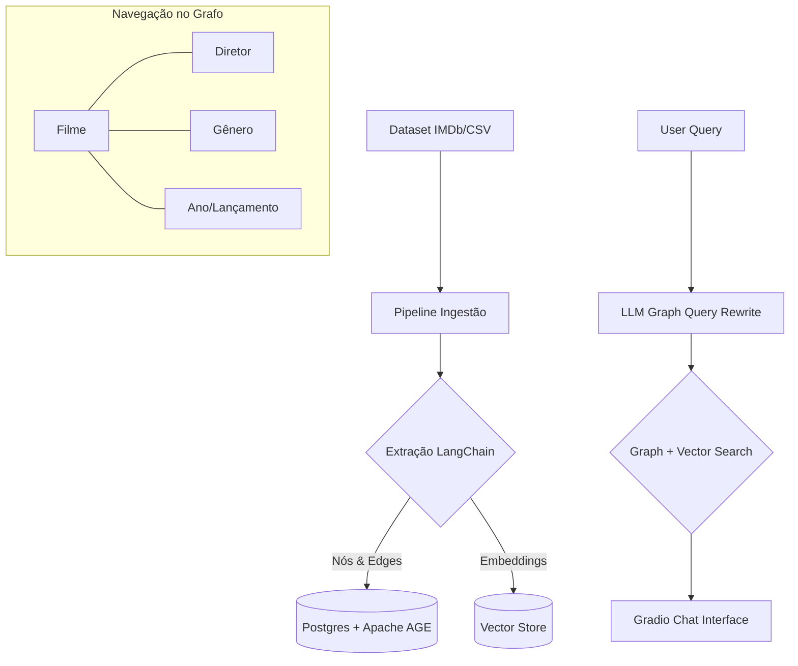

# 🎬 CineGraph-AI: GraphRAG para Descoberta de Filmes


> **Elevando a recomendação de filmes através de Grafos de Conhecimento e Inteligência Semântica.**

---

## 📌 O Problema

Sistemas de recomendação tradicionais são baseados em filtros simples (Ano, Gênero) ou em buscas por palavras-chave. Eles falham em responder perguntas contextuais complexas que exigem correlação de dados e análise de enredo, como:

> *"Quais suspenses da década de 90 com nota maior que 8.0 possuem tramas envolvendo assaltos a banco e foram dirigidos pelo mesmo diretor de 'Filme X'?"*

## 💡 A Solução: GraphRAG

O **CineGraph-AI** utiliza a arquitetura **GraphRAG** para conectar metadados estruturados a descrições semânticas. O sistema não apenas "busca" filmes, ele "navega" pela rede de diretores, gêneros e linhas do tempo antes de aplicar a busca vetorial no enredo.

### Benefícios
- **Descoberta Relacional**: Encontre conexões entre diretores e temas que filtros comuns ignoram.
- **Filtros Híbridos**: Combine meta-dados (IMDb Rating, Year) com busca semântica (Description) em uma única consulta.
- **Explicação de Resposta**: O sistema consegue explicar *por que* recomendou um filme com base nos nós do grafo.

---

## 🏗️ Arquitetura da POC



---

## 🧬 Modelo de Dados (Ontologia)

Baseado nas colunas específicas do dataset:

- **Nós (Entidades):**
    - `Movie`: Título, Nota IMDb (`IMDb Rating`), Duração, Descrição.
    - `Director`: Nome do diretor.
    - `Genre`: Ação, Suspense, Drama, etc.
    - `Year`: Ano de lançamento.

- **Relacionamentos:**
    - `Movie` → `DIRECTED_BY` → `Director`
    - `Movie` → `IN_GENRE` → `Genre`
    - `Movie` → `RELEASED_IN` → `Year`

---

## 🎭 Cenário de Teste: "A Recomendação Perfeita"

**Pergunta do Usuário:** 
*"Me recomende filmes de ficção científica bem avaliados dirigidos pelo Christopher Nolan que falem sobre manipulação do tempo."*

| Etapa | Processamento GraphRAG |
| :--- | :--- |
| **Passo 1: Grafo** | Localiza `Director: Christopher Nolan` → Filtra `Genre: Sci-Fi` → Filtra `IMDb Rating > 8.0`. |
| **Passo 2: Vetor** | Realiza busca semântica na coluna `Description` dos filmes filtrados buscando "manipulação do tempo". |
| **Passo 3: Resposta** | Retorna **Interstellar** e **Tenet**, explicando a conexão histórica do diretor com o tema. |

---

## 🛠️ Tech Stack Final

- **Efetor:** **Cookiecutter Data Science** (Padronização da estrutura de pastas de ciência de dados)
- **Linguagem:** Python 3.10
- **Orquestração:** **LangChain**
- **Armazenamento:** **PostgreSQL + Apache AGE** (Grafo Local)
- **Interface:** **Gradio**
- **Embeddings:** OpenAI (`text-embedding-3-small`)

---

## 🛠️ Decisões de Design & Trade-offs

### Por que Apache AGE sobre Neo4j?
A escolha pelo **Apache AGE (PostgreSQL Extension)** em vez de uma instância isolada de Neo4j foi estratégica:
*   **Ecossistema Unificado:** Mantemos dados relacionais (SQL) e grafos (Cypher) no mesmo banco de dados. Isso elimina a necessidade de múltiplos drivers e reduz a complexidade da infraestrutura.
*   **Latência de Rede:** Consultas híbridas que cruzam metadados (SQL) e relações (Grafos) ocorrem internamente no banco, evitando o "overhead" de rede entre serviços distintos.

### Busca Híbrida: Reciprocal Rank Fusion (RRF)
Para combinar os resultados determinísticos do Grafo com a busca probabilística do Vector Store, implementamos o **RRF**. Isso permite que filmes que aparecem em ambas as buscas (ex: conexão forte no grafo e alta similaridade no enredo) sejam priorizados no ranking sem a necessidade de normalizar scores de escalas diferentes.

---

## 📊 Observabilidade e Avaliação (RAGas & MLflow)
Um projeto de IA sênior exige métricas claras e rastreabilidade.
*   **MLflow:** Utilizamos para versionar experimentos de busca (ex: testar diferentes pesos no RRF) e logar os prompts utilizados.
*   **RAGas:** Framework para avaliar a qualidade intrínseca do RAG:
*   **Faithfulness:** O quanto a recomendação do LLM é baseada apenas nos fatos recuperados do grafo/vetor.
*   **Answer Relevance:** A resposta realmente atende à intenção original do usuário?
*   **Context Precision:** O sistema recuperou os filmes mais relevantes nas primeiras posições?

---

## ⚙️ Engenharia de Produção

### Estratégia de Chunking
As descrições dos filmes são curtas, mas variam em densidade. Utilizamos um `RecursiveCharacterTextSplitter` com *overlap* estratégico de 10%, garantindo que o contexto semântico não seja quebrado em passagens de clímax do enredo.

### Semantic Caching
Para reduzir custos de API (OpenAI) e latência em perguntas repetitivas ("Filmes do Nolan"), implementamos um **Cache Semântico**. Perguntas com similaridade > 0.95 utilizam respostas pré-computadas.

---

## 🚀 API & Integração
Embora a interface visual use **Gradio**, o core do sistema é exposto via **FastAPI**, permitindo:
*   Documentação Automática (**Swagger/ReDoc**).
*   Endpoints de ingestão assíncrona.
*   Fácil integração com outros microserviços.

---

## 📁 Estrutura do Projeto

```text
├── data
│   ├── external       # Dados de fontes externas
│   ├── interim        # Dados intermediários transformados
│   ├── processed      # Conjunto final de dados para modelagem
│   └── raw            # Dados originais e imutáveis (Ex: movies.csv)
├── docs               # Documentação do projeto e Sphinx
├── models             # Modelos treinados e serializados
├── notebooks          # Jupyter notebooks para experimentação
├── references         # Dicionários de dados, manuais e materiais de apoio
├── reports            # Análises em PDF, HTML, etc.
│   └── figures        # Gráficos e visualizações para os relatórios
├── src                # Código-fonte do projeto
│   ├── data           # Scripts para baixar ou gerar dados
│   ├── features       # Scripts para transformar dados em features
│   ├── models         # Scripts para treinar e prever modelos
│   └── visualization  # Scripts para criar visualizações
└── requirements.txt   # Arquivo de dependências
```

---

## 🚀 Como Executar

### 1. Preparação do Ambiente
```powershell
# Clone o repositório
git clone https://github.com/RichardMan13/ContextGraph-AI.git

# Crie e ative o ambiente virtual
python -m venv .venv
.\.venv\Scripts\activate

# Instale as dependências
pip install -r requirements.txt
```

### 2. Configuração de Infraestrutura
1. **Suba os serviços (Docker):**
   ```powershell
   docker-compose up -d
   ```
2. **Configure o `.env`:**
   Copie o template e insira sua `OPENAI_API_KEY`:
   ```powershell
   copy .env.example .env
   ```

### 3. Ingestão e Execução
1. **Prepare os dados:** Garanta que o `movies.csv` esteja em `data/raw/`.
2. **Execute o processamento:** (Scripts em breve na Fase 2 e 3).
3. **Inicie a Interface:**
   ```powershell
   python src/app.py
   ```

---

## 🗺️ Plano de Execução

### 🏗️ Fase 1: Setup do Ambiente & Infraestrutura
- [ ] **Configuração do Docker**: Criar `docker-compose.yml` (PostgreSQL + Apache AGE + MLflow).
- [ ] **Ambiente Python**: Configurar venv com **Python 3.10**.
- [ ] **Dependências**: LangChain, Gradio, Pandas, Psycopg2, MLflow.
- [ ] **Variáveis**: Configurar `.env` para chaves de API.

### 🧹 Fase 2: Preparação e Limpeza de Dados
- [ ] **Análise do Dataset**: Validar colunas `Directors`, `Genres` e `Description`.
- [ ] **Normalização**: Limpeza de strings e tratamento de nulos.

### 🗄️ Fase 3: Ingestão no Knowledge Graph (Postgres + AGE)
- [ ] **Schema AGE**: Criar `graph_path` no Apache AGE.
- [ ] **Ingestão**: Inserir nós e relacionamentos (`DIRECTED_BY`, `IN_GENRE`, `RELEASED_IN`).

### 🧠 Fase 4: Vetorização e Recuperação Semântica
- [ ] **Embeddings**: Gerar vetores para as `Descriptions`.
- [ ] **Hibridização**: Criar função de busca híbrida (Grafo + Vetor).

### 🔗 Fase 5: Integração LangChain (Cérebro do GraphRAG)
- [ ] **Cadeia de Grafo**: Prompt para geração de Cypher (Apache AGE).
- [ ] **Orquestrador**: Lógica de filtros e refinamento.

### 🖥️ Fase 6: Interface Gradio
- [ ] **Layout do Chat**: Implementar `gr.ChatInterface`.

### 🧪 Fase 7: Testes e Validação
- [ ] **Cenários Complexos**: Validar conexões e filtros dinâmicos.

---

<div align="center">
  <sub>Construído para a revolução na descoberta de conteúdo audiovisual.</sub>
</div>