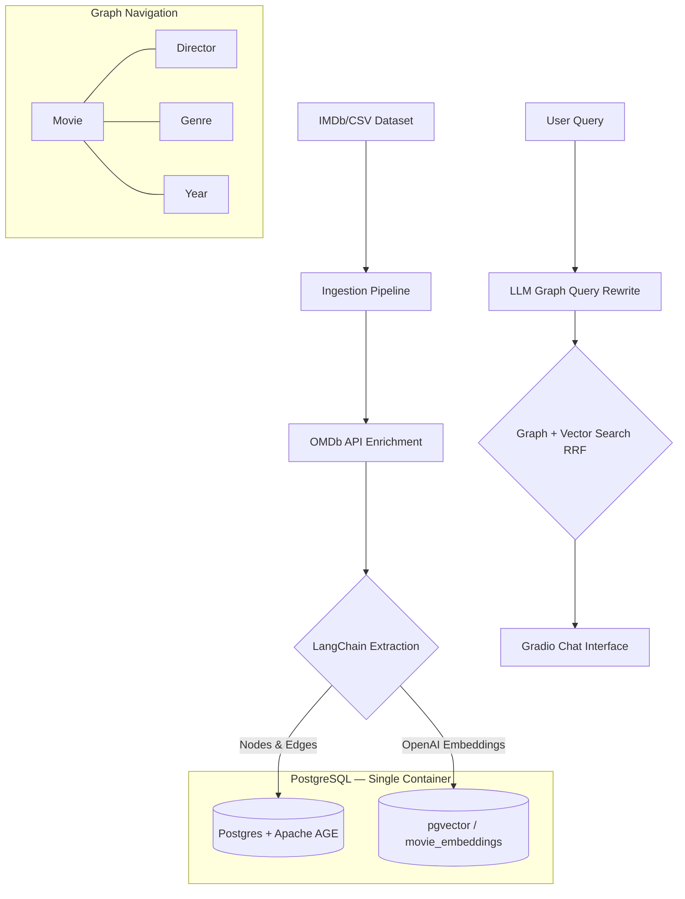

# 🎬 CineGraph-AI: Personal GraphRAG Movie Archive


> **Transforming your personal IMDb watchlist into a navigable semantic memory using Knowledge Graphs.**

---

## 📌 The Problem

Traditional recommendation systems focus on discovery, but they ignore your personal history. It's hard to find patterns or recall specific movies from your own past based on complex themes, such as:

> *"Which science fiction movies that I've seen were directed by Christopher Nolan and involved time manipulation?"*

## 💡 The Solution: GraphRAG

**CineGraph-AI** utilizes the **GraphRAG** architecture to turn your IMDb export into a private Knowledge Base. The system doesn't just "recommend"; it helps you "remember" and "correlate" directors, genres, and themes from your own personal cinema journey.

### Benefits
- **Personal Archive Discovery**: Find connections between movies you've watched that standard apps ignore.
- **Memory Filters**: Combine metadata (IMDb Rating, Year) with semantic plot recall from your own history.
- **Contextual Recall**: The system explains *why* a movie from your past fits your current query.

---

## 🏗️ POC Architecture



---

## 🧬 Data Model (Ontology)

Based on actual columns from the dataset (`data/raw/movies.csv` — IMDb watchlist export, 792 movies, 18 columns):

| Column | Type | Use |
| :--- | :--- | :--- |
| `Title` / `Original Title` | `str` | Primary identifier for the `Movie` node |
| `IMDb Rating` | `float` | `Movie` node property (numerical filter) |
| `Runtime (mins)` | `float` | `Movie` node property |
| `Year` | `float` | `Year` node (`RELEASED_IN` relationship) |
| `Genres` | `str` | `Genre` nodes (comma-separated list) |
| `Directors` | `str` | `Director` node |
| `Num Votes` | `int` | `Movie` node property (popularity) |
| `Release Date` | `str` | `Movie` node property |
| `URL` | `str` | IMDb link — used to enrich data via API |
| `Your Rating` | `float` | Personalization signal |
| `Description` | — | ⚠️ **100% NULL in dataset** — external enrichment mandatory |

> ⚠️ **Critical Gap:** The `Description` column is completely empty. The vector search layer depends on plot descriptions. The strategy is to **enrich the data via [OMDb API](https://www.omdbapi.com/)** using the `Const` field (IMDb ID) to fetch the `Plot` for each movie.

- **Nodes (Entities):**
    - `Movie`: `Title`, `IMDb Rating`, `Runtime (mins)`, `Num Votes`, `Plot` (enriched via OMDb).
    - `Director`: Director's name.
    - `Genre`: Action, Sci-Fi, Drama, etc.
    - `Year`: Release year.

- **Relationships:**
    - `Movie` → `DIRECTED_BY` → `Director`
    - `Movie` → `IN_GENRE` → `Genre`
    - `Movie` → `RELEASED_IN` → `Year`

---

## 🎭 Test Scenario: "The Perfect Recommendation"

**User Question:**
*"Recommend well-rated science fiction movies directed by Christopher Nolan that talk about time manipulation."*

| Step | GraphRAG Processing |
| :--- | :--- |
| **Step 1: Graph** | Locates `Director: Christopher Nolan` → Filters `Genre: Sci-Fi` → Filters `IMDb Rating > 8.0`. |
| **Step 2: Vector** | Performs semantic search on the `Plot` field of filtered movies looking for "time manipulation". |
| **Step 3: Response** | Returns **Interstellar** and **Tenet**, explaining the director's historical connection to the theme. |

---

## 🛠️ Final Tech Stack

| Layer | Technology | Justification |
| :--- | :--- | :--- |
| **Structure** | Cookiecutter Data Science | Folder standardization |
| **Language** | Python 3.10 | Mature ML ecosystem |
| **LLM** | OpenAI `gpt-4o-mini` | Reliable Cypher generation + Answer chain |
| **Orchestration** | LangChain + langchain-postgres | Graph → Vector chain (LCEL) |
| **Database** | PostgreSQL + Apache AGE | Graph (Cypher) in SQL |
| **Vector Store** | pgvector (`movie_embeddings`) | Vectors in the same PostgreSQL container |
| **Embeddings** | OpenAI `text-embedding-3-small` | 1536 dims, ideal cost/quality for POC |
| **Interface** | Gradio | Fast UI prototyping |
| **Enrichment** | OMDb API | Plots for the 792 movies in the dataset |

---

## 🛠️ Design Decisions & Trade-offs

### Why Apache AGE + pgvector over Neo4j + ChromaDB?
The choice of **Apache AGE** + **pgvector** within the same PostgreSQL was strategic:
*   **Unified Ecosystem:** Relational data (SQL), graphs (Cypher via AGE), and vectors (pgvector) in the **same database and same Docker container**. This eliminates multiple drivers and reduces infrastructure complexity.
*   **Zero Network Latency:** Hybrid queries crossing Graph (AGE) + Vector (pgvector) occur internally in the database.
*   **HNSW Index:** pgvector with HNSW index ensures efficient ANN search as the dataset grows.

### Hybrid Search: Reciprocal Rank Fusion (RRF)
To combine deterministic results from the Graph with probabilistic search from the Vector Store, we implemented **RRF**. This prioritizes movies appearing in both searches (e.g., strong graph connection and high plot similarity) without needing to normalize scores from different scales.

---

## 📊 Observability and Evaluation (RAGas & MLflow)
A senior AI project requires clear metrics and traceability.
*   **MLflow:** Versions search experiments and logs prompts. Accessible at `http://localhost:5000`.
*   **RAGas** (`src/models/evaluate.py`): **One-shot offline** script to measure system quality using a golden dataset of ~15 Q&A pairs. Results logged in MLflow:
    *   **Faithfulness:** Is the LLM's recommendation based only on facts retrieved from the graph/vector?
    *   **Answer Relevance:** Does the response meet the user's original intent?
    *   **Context Precision:** Did the system retrieve the most relevant movies in the top positions?

---

## ⚙️ Production Engineering

### Chunking Strategy
The `Plot` fields (OMDb enriched) are short texts (~1-3 sentences). They don't require aggressive chunking. We use a `RecursiveCharacterTextSplitter` with `chunk_size=512` and `chunk_overlap=50`, ensuring semantic context isn't truncated.

### Data Enrichment (OMDb API)
Before vectorization, an enrichment script (`src/data/enrich_plots.py`) iterates over the `Const` (IMDb ID) of each movie and queries the OMDb API. Results are saved in `data/interim/movies_enriched.csv`.

### Semantic Caching
To reduce API costs (OpenAI) and latency for repetitive questions, we use LangChain's **`InMemoryCache`**.

---

## 🚀 API & Integration
Gradio is mounted **inside** FastAPI via `gr.mount_gradio_app()`:

| Route | Description |
| :--- | :--- |
| `GET /` | Gradio Interface (`gr.Blocks`) |
| `GET /docs` | Swagger UI (Auto-generated FastAPI) |
| `POST /api/v1/recommend` | Recommendation endpoint (JSON in/out) |
| `POST /api/v1/ingest` | Asynchronous ingestion trigger |
| `GET /api/v1/health` | API Health check |

---

## 📁 Project Structure

```text
ContextGraph-AI/
├── data/
│   ├── raw/
│   │   └── movies.csv              # ✅ IMDb watchlist export (792 movies)
│   ├── interim/
│   │   └── movies_enriched.csv     # ⚙️ Generated by enrich_plots.py
│   └── processed/                  # Final embeddings / artifacts
│
├── docker/
│   └── init-db.sql                 # ✅ Bootstrap: AGE graph + pgvector setup
│
├── references/
│   └── golden_dataset.json         # ✅ ~15 Q&A pairs for RAGas evaluation
│
├── notebooks/                      # Exploratory analysis
│
├── src/
│   ├── __init__.py
│   ├── app.py                      # ✅ Entry point: FastAPI + Gradio
│   │
│   ├── api/
│   │   └── routes.py               # ✅ API Endpoints
│   │
│   ├── chains/
│   │   ├── graph_chain.py          # ✅ Stage 1: NL → Cypher → AGE
│   │   ├── vector_chain.py         # ✅ Stage 2: pgvector search
│   │   └── graphrag_chain.py       # ✅ Orchestrator: Hybrid Chain
│   │
│   ├── data/
│   │   └── enrich_plots.py         # ✅ OMDb API enrichment
│   │
│   ├── models/
│   │   └── evaluate.py             # ✅ RAGas evaluation script
│   │
│   ├── prompts/
│   │   ├── cypher_prompt.py        # ✅ Cypher generation prompt
│   │   └── answer_prompt.py        # ✅ Final answer generation prompt
│   │
│   ├── tools/
│   │   ├── graph_retriever.py      # ✅ Apache AGE executor
│   │   └── vector_retriever.py     # ✅ PGVector wrapper
│   │
│   └── ui/
│       └── blocks.py               # ✅ Gradio UI Layout
│
├── Dockerfile.db                   # ✅ PostgreSQL + AGE + pgvector
├── docker-compose.yml              # ✅ Services: db + mlflow
├── requirements.txt                # ✅ Dependencies
├── .env                            # ✅ Config (gitignored)
└── .env.example                    # ✅ Template
```

---

## 🚀 How to Run

### 1. Environment Preparation
```powershell
# Clone the repository
git clone https://github.com/RichardMan13/ContextGraph-AI.git

# Create and activate virtual environment
python -m venv .venv
.\.venv\Scripts\activate

# Install dependencies
pip install -r requirements.txt
```

### 2. Infrastructure Configuration
1. **Configure `.env`** with your API keys.
2. **Start services (Docker):**
   ```powershell
   docker-compose up -d
   ```

### 3. Data Enrichment (Required)
```powershell
python src/data/enrich_plots.py
```

### 4. Ingestion and Execution
1. **Ingest data into Graph + pgvector:**
   ```powershell
   make ingest
   make embed
   ```
2. **Start the server:**
   ```powershell
   make run
   # Interface:  http://localhost:7860
   # Swagger:    http://localhost:7860/docs
   # MLflow:     http://localhost:5000
   ```

---

## 🗺️ Execution Plan

> **Overall Progress:** Phase 1-7 Completed

---

### 🏗️ Phase 1: Environment & Infrastructure — ✅ Completed
- [x] **Python Environment**: venv configured
- [x] **Docker Infrastructure**: DB (AGE + pgvector) and MLflow services running
- [x] **Init SQL**: Automated DB schema setup

### 🧹 Phase 2: Data Preparation — ✅ Completed
- [x] **Dataset Enrichment**: 98.6% plot coverage via OMDb API

### 🗄️ Phase 3: Knowledge Graph Ingestion — ✅ Completed
- [x] **AGE Ingestion**: 675 movies inserted as Graph nodes

### 🧠 Phase 4: Vectorization — ✅ Completed
- [x] **Embeddings**: pgvector populated with 673 encoded plots

### 🧩 Phase 5: LangChain Integration — ✅ Completed
- [x] **Hybrid Chain**: Graph + Vector orchestration implemented

### 🖥️ Phase 6: User Interface — ✅ Completed
- [x] **Gradio Web UI**: Split layout with streaming and movie cards

### 🧪 Phase 7: Testing & Evaluation — ✅ Completed
- [x] **RAGas Benchmark**: Automated evaluation pipeline integrated with MLflow

---

<div align="center">
  <sub>Built for the revolution in media discovery.</sub>
</div>
