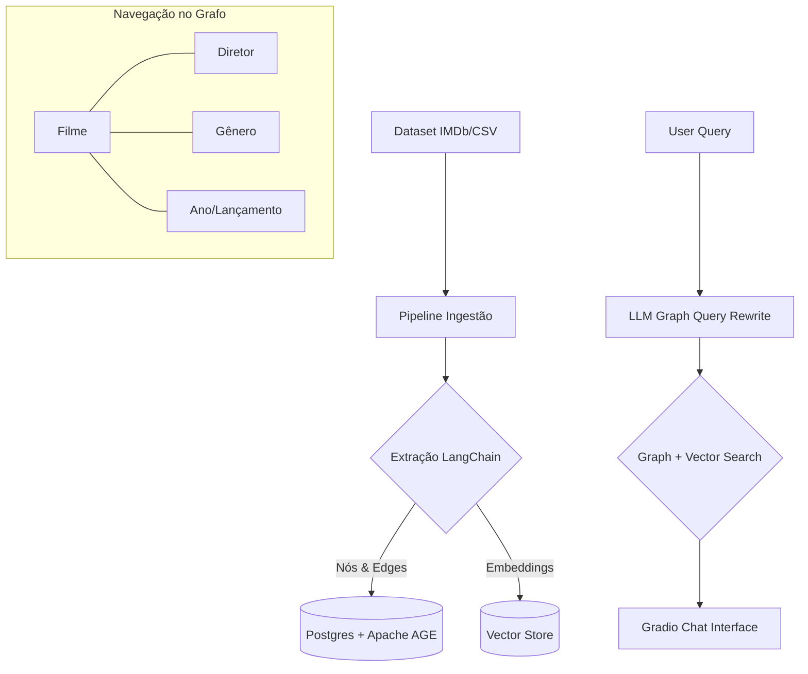

# 🎬 CineGraph-AI: GraphRAG para Descoberta de Filmes

> **Elevando a recomendação de filmes através de Grafos de Conhecimento e Inteligência Semântica.**

---

## 📌 O Problema

Sistemas de recomendação tradicionais são baseados em filtros simples (Ano, Gênero) ou em buscas por palavras-chave. Eles falham em responder perguntas contextuais complexas que exigem correlação de dados e análise de enredo, como:

> *"Quais suspenses da década de 90 com nota maior que 8.0 possuem tramas envolvendo assaltos a banco e foram dirigidos pelo mesmo diretor de 'Filme X'?"*

## 💡 A Solução: GraphRAG

O **CineGraph-AI** utiliza a arquitetura **GraphRAG** para conectar metadados estruturados a descrições semânticas. O sistema não apenas "busca" filmes, ele "navega" pela rede de diretores, gêneros e linhas do tempo antes de aplicar a busca vetorial no enredo.

### Benefícios
- **Descoberta Relacional**: Encontre conexões entre diretores e temas que filtros comuns ignoram.
- **Filtros Híbridos**: Combine meta-dados (IMDb Rating, Year) com busca semântica (Description) em uma única consulta.
- **Explicação de Resposta**: O sistema consegue explicar *por que* recomendou um filme com base nos nós do grafo.

---

## 🏗️ Arquitetura da POC

---

## 🧬 Modelo de Dados (Ontologia)

Baseado nas colunas específicas do dataset:

- **Nós (Entidades):**
    - `Movie`: Título, Nota IMDb (`IMDb Rating`), Duração, Descrição.
    - `Director`: Nome do diretor.
    - `Genre`: Ação, Suspense, Drama, etc.
    - `Year`: Ano de lançamento.

- **Relacionamentos:**
    - `Movie` → `DIRECTED_BY` → `Director`
    - `Movie` → `IN_GENRE` → `Genre`
    - `Movie` → `RELEASED_IN` → `Year`

---

## 🎭 Cenário de Teste: "A Recomendação Perfeita"

**Pergunta do Usuário:** 
*"Me recomende filmes de ficção científica bem avaliados dirigidos pelo Christopher Nolan que falem sobre manipulação do tempo."*

| Etapa | Processamento GraphRAG |
| :--- | :--- |
| **Passo 1: Grafo** | Localiza `Director: Christopher Nolan` → Filtra `Genre: Sci-Fi` → Filtra `IMDb Rating > 8.0`. |
| **Passo 2: Vetor** | Realiza busca semântica na coluna `Description` dos filmes filtrados buscando "manipulação do tempo". |
| **Passo 3: Resposta** | Retorna **Interstellar** e **Tenet**, explicando a conexão histórica do diretor com o tema. |

---

## 🛠️ Tech Stack Final

- **Efetor:** **Cookiecutter Data Science** (Padronização da estrutura de pastas de ciência de dados)
- **Linguagem:** Python 3.10
- **Orquestração:** **LangChain**
- **Armazenamento:** **PostgreSQL + Apache AGE** (Grafo Local)
- **Interface:** **Gradio**
- **Embeddings:** Gemini Pro / OpenAI / HuggingFace

---

## 🗺️ Plano de Execução

### 🏗️ Fase 1: Setup do Ambiente & Infraestrutura
- [ ] **Configuração do Docker**: Criar `docker-compose.yml` (PostgreSQL + Apache AGE).
- [ ] **Ambiente Python**: Configurar venv com **Python 3.10**.
- [ ] **Dependências**: LangChain, Gradio, Pandas, Psycopg2.
- [ ] **Variáveis**: Configurar `.env` para chaves de API.

### 🧹 Fase 2: Preparação e Limpeza de Dados
- [ ] **Análise do Dataset**: Validar colunas `Directors`, `Genres` e `Description`.
- [ ] **Normalização**: Limpeza de strings e tratamento de nulos.

### 🗄️ Fase 3: Ingestão no Knowledge Graph (Postgres + AGE)
- [ ] **Schema AGE**: Criar `graph_path` no Apache AGE.
- [ ] **Ingestão**: Inserir nós e relacionamentos (`DIRECTED_BY`, `IN_GENRE`, `RELEASED_IN`).

### 🧠 Fase 4: Vetorização e Recuperação Semântica
- [ ] **Embeddings**: Gerar vetores para as `Descriptions`.
- [ ] **Hibridização**: Criar função de busca híbrida (Grafo + Vetor).

### 🔗 Fase 5: Integração LangChain (Cérebro do GraphRAG)
- [ ] **Cadeia de Grafo**: Prompt para geração de Cypher (Apache AGE).
- [ ] **Orquestrador**: Lógica de filtros e refinamento.

### 🖥️ Fase 6: Interface Gradio
- [ ] **Layout do Chat**: Implementar `gr.ChatInterface`.

### 🧪 Fase 7: Testes e Validação
- [ ] **Cenários Complexos**: Validar conexões e filtros dinâmicos.

---

  Construído para a revolução na descoberta de conteúdo audiovisual.

